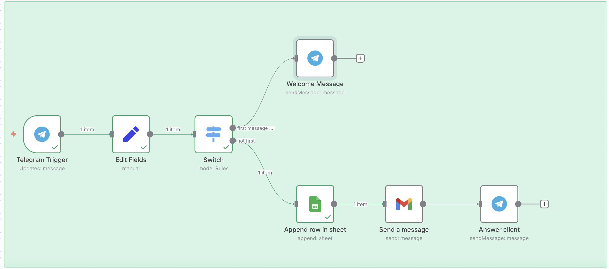
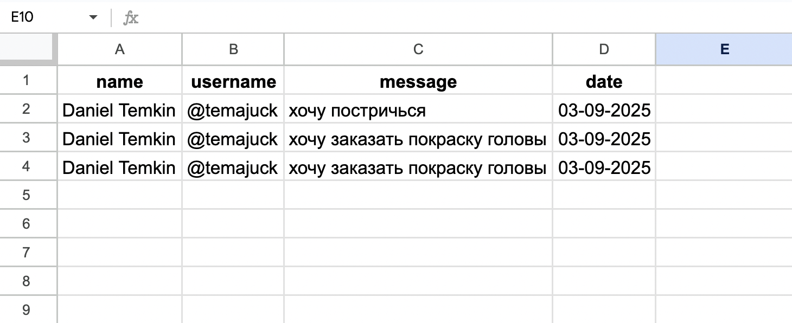
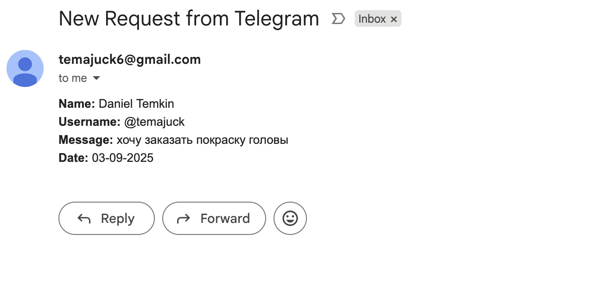

# Telegram → Google Sheets → Gmail Automation (n8n Workflow)

This project demonstrates how to automate **customer requests** using [n8n](https://n8n.io/).  
The workflow connects **Telegram**, **Google Sheets**, and **Gmail** to streamline request handling for small businesses.  

---

## 🚀 Features
- ✅ Capture messages from a **Telegram bot**  
- ✅ Automatically save requests to **Google Sheets** (name, username, message, date)  
- ✅ Send a formatted **email notification** to the manager  
- ✅ Auto-reply to the user in Telegram confirming the request  
- ✅ Date formatting for clean records (e.g., `03.09.2025 20:01`)  

---

## 📂 Workflow Overview
1. **Telegram Trigger** → Listens for new messages from the bot.  
2. **Edit Fields + Date & Time** → Extracts fields and formats the date.  
3. **Google Sheets (Append Row)** → Stores the request.  
4. **Gmail (Send Email)** → Sends a structured email notification.  
5. **Telegram (Send Message)** → Sends confirmation back to the user.  

---

## 🖼️ Screenshots
### Workflow in n8n

### Google Sheets Output

### Email Notification

---

## 📋 Example Output

**Google Sheets Entry:**
| name         | username | message                | date             |
|--------------|----------|------------------------|------------------|
| Daniel Temkin | temajuck | Problem with intercom  | 03.09.2025 20:01 |

---

## 🛠️ Technologies
- [n8n](https://n8n.io/) – Workflow automation  
- Telegram API  
- Google Sheets API  
- Gmail API  

---

## 📦 How to Use
1. Clone this repository.  
2. Import the `workflow.json` file into your **n8n** instance.  
3. Configure credentials for:
   - Telegram Bot Token (via @BotFather)  
   - Google Sheets API  
   - Gmail API  
4. Run the workflow and send a message to your Telegram bot.  

---

## 💡 Use Cases
- Lead generation for small businesses  
- Customer support automation  
- Service request tracking  
- Simple CRM prototype  

---

## 📜 License
This project is released under the MIT License.

